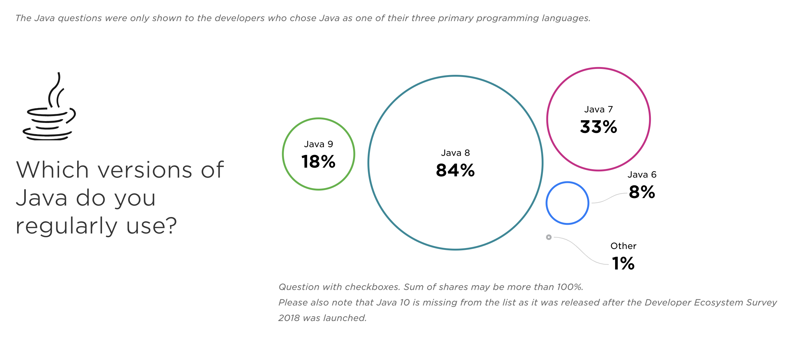
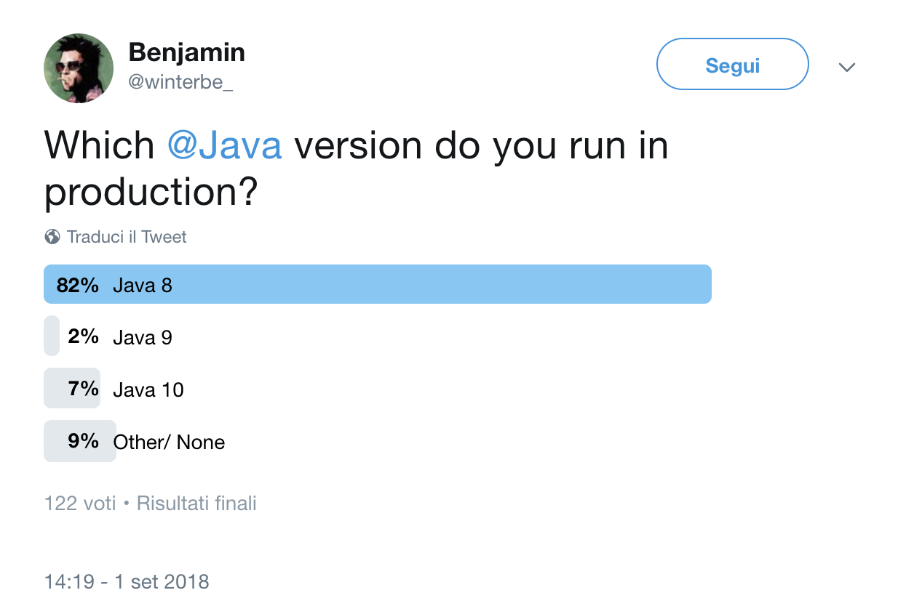

# Beyond 
# Java 8
### What should you know?

---

| What is going to **happen**?              | 
| -----------                               |
| What is going to **change**?              |
| Is still Java **free**?                   |
| How **hard** is it to update to Java 11?  |
| What's new in the new **JDK**             |

---

### Topics

* **Six-month** release cycle
* New **licensing** and **long-term support** (LTS) models
* **OpenJDK** is the new normal
* From Java 8 onto a **modular** and flexible JDK

---

### Java's old release cadence

In the past, Java major releases where   
**long-running** and **irregular**

* Java 7 took 5 years
* Java 8 took 3 years
* Java 9 took 3.5 years 

---

### Java's old release cadence

"Fat" releases had a **massive impact**   
on the way we write Java code

* **Java 5**: Generics
* **Java 8**:
  * Functional constructs
  * Streams
  * Method Reference (`::`)
* **Java 9**: Java Module System (_Jigsaw_)

---

### New Release Cadence
A brand-new major Java SE version will be released **every 6 months** (in *September* and *March*)

> The rate of innovation doesn’t change.    
> The rate of innovation delivery increases. 
> 
> — Mark Reinhold 

**This started with Java 9, released in September 2017**

---

|Then                   |
|-----------------------|
| Mar 18 Java 10        |
| Sep 18 Java 11 (LTS)  |
| Mar 19 Java 12        |
| Sep 19 Java 13        |
| Mar 20 Java 14        |
| Sep 20 Java 15        |
| Mar 21 Java 16        |
| Sep 21 Java 17 (LTS)  |
| ...                   |

---

### What about Java 8?

* **Released 03/2014**
* **is a LTS release** 
* **free support ends 01/2019**

---

### Java 9
* **Released 09/2017**
* **Already unmantained**
  * free support ended *03/2018*

---

### Java 10
* **Released 03/2018**
* **Already unmantained**
  * free support ended *09/2018*

---

### Java 11

Current version of Java, which is a LTS:
* **free updates from 09/2018 to 03/2019** (six months)
* **OracleJDK commercial support for 5+ years**
* **free updates from AdoptOpenJDK**

---

### OpenJDK Is The New Default

Starting from JDK 11, [OpenJDK](https://openjdk.java.net/) is the official JDK source code repository.

---

### OpenJDK Is The New Default

From the **OpenJDK** repo, each vendor build its binary distribution:

* Oracle builds and mantains [OracleJDK](https://java.oracle.com/) 
* Oracle also - during the life of a JDK version, 6 months - builds and ships the binary of [OpenJDK](http://jdk.java.net/)
* [AdoptOpenJDK](https://adoptopenjdk.net/) - checks out source code and build their binary version of JDK
* **RedHat JDK** ( + their stuff, e.g. [Shenandoah GC](https://wiki.openjdk.java.net/display/shenandoah/Main))
* **AzulJDK** binary => **Zulu**

⇝ **OpenJDK** is the new normal!

---

### LTS? Free? Commercial?

During the 6 months of life of Java 11

* **OpenJDK** binary, **AdoptOpenJDK**, Azul **Zulu** 
  * all GPL license. 
  * You can use them for free in production.
* **OracleJDK** 
  * pay for use it in production _(from version 11 onwards)_.

---

### What happens in March 2019 when Java 11 ends its life?

You can choose: 
* **upgrade to Java 12**
* **stay in Java 11** 

---

If you **stay on Java 11**, you could

* **Never update** 
  * => exposed to security vulnerabilities, bugs, ...
* **Update to Java 11.0.something** 
  * => BUT where do you take that patched version?

---

### Oracle will fix / patch only the current JDK version 
* (actually OpenJDK 11)
* **No backporting** on the previous versions!

---

### Oracle will also backport to current Oracle JDK LTS version (OracleJDK 11) 

but you'll need a **"Java SE Subscription"** to have the LTS updated binary   
_(this is actually what LTS means)_ 

---

### Who fix the older versions?

* The **community** + **RedHat** _should_ backport fixes
* **How much time** will be taken to fix a vulnerability once found (and published)? Nobody knows! We'll see...

---

### Vendors create binary builds 

After RedHat+Community fix / patch the source repo, someone will have to **build a new JDK binary distribution** with that bug/vulnerabilities fixed.

* **AdoptOpenJDK** => offers free builds of LTS JDK (via GPL)
* other vendors (**Oracle**, **RedHat**, **IBM**, **Azul**, ...) => you have to **pay** for this!

---
<!-- .slide: style="text-align: left;" -->  

> _Let me assure you of one thing: whether by Oracle or Red Hat or someone else, JDK LTS releases will continue to be supported. We all have a lot invested in Java, and we won’t let it fall._

>— [Andrew Haley, Red Hat](http://mail.openjdk.java.net/pipermail/jdk-dev/2018-August/001826.html)

---

### Java9: Java Module System

* Java 8 was all about **how we write code differently**.
* Java 9 is all about **how we package and deploy our code**. There are almost no code change.

---

### Java9: Java Module System

* Java 8 changes **how we think to and write code**. 
* Java 9 changes **how we package code**.

---

### Some breaking changes 

* Upgrading from 8 to 9/10/11 **is NOT simple**
* **Many runtime behavior changes**
* Needs very **thorough testing**

---

### Loading resources

```java
URL resource = sysCL.getResource("/com/foo/bar.properties"); 
// It’s there, but it won’t find it! 
resource = null;
```

---

### What about Phoenix?

```java
⋊> ~/D/w/m/phoenix-project on master ⨯ rg -i "class.*getResource\("                                 

ispservicestub/src/com/xpeppers/ispservicestub/ISPServiceStubEnvironment.java
21:   return this.getClass().getClassLoader().getResource(configurationFilePath);

alipaystub/src/com/xpeppers/alipaystub/AlipayStubEnvironment.java
21:   return this.getClass().getClassLoader().getResource(configurationFilePath);

mybankstub/src/com/xpeppers/main/MyBankStubEnvironment.java
19:   return this.getClass().getClassLoader().getResource(configurationFilePath);

phoenix/src/com/xpeppers/phoenix/main/BatchEnvironment.java
38:   return this.getClass().getClassLoader().getResource(configurationFilePath);

stresstest/src/com/xpeppers/phoenix/stress/StressTest.java
12:   URL confFile = this.getClass().getClassLoader().getResource("stresstest.properties");

simonidis/src/com/xpeppers/phoenix/fakeauthorizationws/SimonidisEnvironment.java
17:   return this.getClass().getClassLoader().getResource(configurationFilePath);

minos/src/com/xpeppers/minos/domain/AcsVereqVerifier.java
24: private final static URL schemaPath = AcsVereqVerifier.class.getResource("/dtd/acs_vereq_schema.xsd");

minos/src/com/xpeppers/minos/domain/validators/PareqSyntaxValidator.java
21: private final static URL schemaPath = PareqSyntaxValidator.class.getResource("/dtd/acs_pareq_schema.xsd");

caffrey/src/com/xpeppers/phoenix/caffrey/cardgateway/CardEnrollmentMapper.java
70:     URL resource = this.getClass().getClassLoader().getResource(configurationFilePath);
```

---

### Internal APIs encapsulated!

* Cannot access `sun.*` or `com.sun.*` classes anymore!

---

# Who cares?

---


### Phoenix!

Just one example: 

```java
minos/src/com/xpeppers/minos/domain/SignXMLDOMforNewHSM.java
3:import com.sun.org.apache.xml.internal.security.c14n.CanonicalizationException;
4:import com.sun.org.apache.xml.internal.security.c14n.Canonicalizer;
5:import com.sun.org.apache.xml.internal.security.c14n.InvalidCanonicalizerException;
23:import static com.sun.org.apache.xml.internal.security.Init.init;
24:import static com.sun.org.apache.xml.internal.security.c14n.Canonicalizer.ALGO_ID_C14N_OMIT_COMMENTS;
```

---

### Java Module System

#### Visibility

**`public`** is not the same anymore!  

A **`public`** class is available, but has to be exported by its containing module to be **"visible"**.    

**`public`** + **`exports`** becomes visible outside the module!

---

### Transitioning

**Old jars will be assumed to be modules in Java 9.**

* Java 9 will assume that the name of the module is the name of the jar
  * e.g. `junit` is the name of the module for the `junit-4.12.jar` jar
* It will also export everything in that jar.    
* It will require all you are using.    

---

### Unnamed Module

All stuff that is in the classpath (tipically jars) will be put into an "unnamed" module.

* It **reads** every named modules.
* It **exposes** every package.
* **Code in named modules cannot depend on code in the unnamed module**.

---

### JShell

`docker run --rm -it openjdk:11-slim  /bin/jshell`

---

### JLink
To create small custom JRE with just your dependencies.

_Smells like a "Docker" approach for the Java world._ 

---

### Migrate to Java 11

#### Start migrating to Java9
#### Then move to Java 11

---

# How?

* First, **update all your dependencies first** (libraries, frameworks, etc)
* **Update your app server to latest version** (is compatible with Java 9) - e.g. Tomcat, Jetty, etc
* _BTW is your IDE ready?_

---

### Resources

* Java 9/10/11 - What's new and why you should upgrade 
  * [slides](https://www.slideshare.net/SimoneBordet/java-91011-whats-new-and-why-you-should-upgrade)
  * [video](https://www.youtube.com/watch?v=cUqcSFLnk_E&list=PLRsbF2sD7JVq4IapQ-Fz6AuHMj2KITL6P&index=17)

* Java Next! Release Cadence, Licensing, And LTS
  * [slides](https://slides.codefx.org/java-next/2018-09-30-codefx@yt/#/)
  * [video](https://www.youtube.com/watch?v=7xkyV2kLb0c&list=PL_-IO8LOLuNqMlbUSiThLaQda6ASUCrLm)

* [Java is Still Free!](https://docs.google.com/document/d/1nFGazvrCvHMZJgFstlbzoHjpAVwv5DEdnaBr_5pKuHo/edit#heading=h.p3qt2oh5eczi)

* [No Free Java LTS Version?
](https://medium.com/codefx-weekly/no-free-java-lts-version-b850192745fb)

----

### Migration guides

* [Java 9 Migration Guide](https://blog.codefx.org/java/java-9-migration-guide/)
* [All You Need To Know For Migrating To Java 11](https://blog.codefx.org/java/java-11-migration-guide/)

----

### On Java 9 Module System

* [Exploring Java 9 by Venkat Subramaniam
](https://www.youtube.com/watch?v=8XmYT89fBKg)
* [Modular Development with JDK 9
](https://www.youtube.com/watch?v=gtcTftvj0d0)

---

[The State of Developer Ecosystem Survey in 2018
](https://www.jetbrains.com/research/devecosystem-2018/java/)



----

[A twitter survey
](https://twitter.com/winterbe_/status/1035864662976413696)



